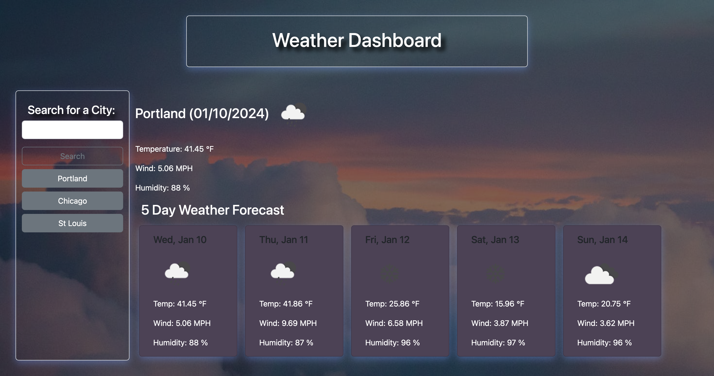

# Weather-App

## About the Project
 Developed a user-friendly weather application to present a detailed 5-day weather forecast for the city of your choosing. Conveniently, cities are stored locally, enabling you to effortlessly retrieve weather information without the inconvenience of repeatedly typing in your preferred locations. This project served as a valuable opportunity to delve into the realm of third-party web API integration. I incorporated the OpenWeatherMap API along with Dayjs JavaScript library to effectively obtain weather data, while leveraging Bootstrap for the structured and visually appealing layout of the web page. This project instilled a newfound appreciation for their immense capabilities and versatility.

 [You can find my link to the deployed project here](https://jtwiley1996.github.io/Weather-App/)

 ## How to Use

 Enter the name of a city to fetch its weather information. Quickly access weather details for saved cities by clicking on them from the sidebar.

## Credits
For this project, I used [OpenWeatherApi](https://openweathermap.org/forecast5#data), [Dayjs](https://day.js.org/en/), and [Bootstrap](https://getbootstrap.com/).

I also used Stack overflow for help on the javascript, as well as W3schools.org and Youtube for help implementing the 3rd Party Apis.
